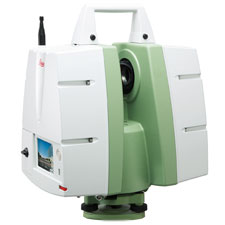

# LEICA SCANSTATION

This repository contains packages created to control in PC, throught ROS interface, the Leica Scanstation C5. 

Due to Leica's libraries dependencies, the source code relative to SDK have been developed under **Windows 10**. 

For that reason, *leica_scanstation_ros* will only compile on Windows OS.

However, once the program is released, it could be executed in either **Windows or Linux** (with tools such us Wine).

In the following sections, it is described which packages are included and an explanation of how to use them.

For **development purposes**, please refer to *leica_scanstation_ros* documentation. 

It is involved in the ROSIN project [Large_3D_inspection](http://wiki.ros.org/large_3d_inspection)

## Package List
- **leica_scanstation_ros**. Based on Leica SDK, this package contains functions to communicate with the device using a computer. Note that this package is meant to be compiled and executed in Windows. It includes a ROS node with the following options:
    - operating the device through ROS services. 
    - to read and understand the information sent by the scanstation which is published in a ROS topic. 
    - to view the video captured by the device which is published as images in another ROS Topic.

- **leica_scanstation_msgs**. This package defines types of messages and services that permit interpretation of the scanner information.
It is OS independent.

- **leica_scanstation_utils**. This package contains common functions that assist in the program's execution independently of the OS used. Its main purpose is to define the paths for generating and collecting the point clouds. 

## Dependencies 
- [ROS for Windows](http://wiki.ros.org/Installation/Windows) // [ROS for Ubuntu](http://wiki.ros.org/Installation/Ubuntu)
- [Wine for ubuntu](https://tecadmin.net/install-wine-on-ubuntu/)
- Eigen3

        sudo apt-get install libeigen3-dev

- Leica HXI SDK.

Note: To get your HXI SDK contact your local Leica supplier.

## Usage
### Windows
1. Setup your workspace as detailed on [leica_scanstation_ros](https://github.com/fada-catec/leica_scanstation/blob/master/leica_scanstation_ros/README.md#set-up)

2. Execute program 

        roslaunch leica_scanstation_ros start.launch

3. Use ROS services to control, move and start scanning on the Scanstation

        rosservice list

### Ubuntu (using Wine)
1. Create a workspace and clone this repo

        mkdir -p ~/catkin_ws/src && cd ~/catkin_ws/src
        git clone https://github.com/fada-catec/leica_scanstation.git

2. Compile (be careful: package *leica_scanstation_ros* is meant to be compiled on Windows) 

        cd ~/catkin_ws
        catkin_make -DCATKIN_BLACKLIST_PACKAGES="leica_scanstation_ros"

3. To be able to execute the program with wine, you need to export it first. Read [how to export program](https://github.com/fada-catec/leica_scanstation/blob/master/leica_scanstation_ros/README.md#export-program) to get more information.

        roscore
        cd .../leica_scanstation_ros/export
        wineconsole leica_scanstation_ros_node.exe

4. Use ROS services to control, move and start scanning on the Scanstation

        rosservice list

## Code API

[Topics, Services, Params](http://wiki.ros.org/leica_scanstation#Code_API)

Read documentation on

`leica_scanstation_ros/doc/html/index.html`

`leica_scanstation_utils/doc/html/index.html`

##  Acknowledgement ##
***
<!-- 
    ROSIN acknowledgement from the ROSIN press kit
    @ https://github.com/rosin-project/press_kit
-->

Supported by ROSIN - ROS-Industrial Quality-Assured Robot Software Components.  
More information: <a href="http://rosin-project.eu">rosin-project.eu</a>

  

This project has received funding from the European Union�s Horizon 2020  
research and innovation programme under grant agreement no. 732287. 

## Help
Ines M. Lara - imlara@catec.aero