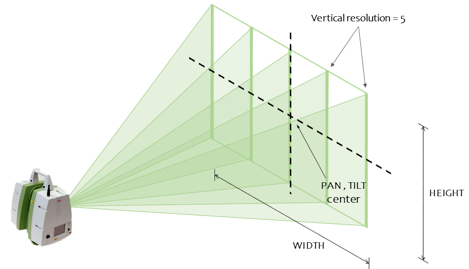

# LEICA SCANSTATION

# 1. Overview
The Leica Scanstation C5 is a scalable long range laser scanner. This package is a ROS wrapper for controlling the scanstation directly from a computer. To achieve this, a collection of ROS services are provided and information received from the scanstation will be published in ROS.

# 2. Getting started

## 2.1. Scan with Leica Scanstation C5
The Leica Scanstation C5 is a scalable and flexible laser scanner, which means that user can set some parameters to better fit the scanning area. 
Using this ROS wrapper, when asking for the equipment to scan, these are the necessary parameters to be indicated and a scheme of what the mean:

- **Pan center** and **tilt center**. Middle point of the scan process.
- **Width** and **height** is the size of the scan window.
- **Vertical resolution** and **horizontal resolution**. Can be understood as the *number of rays* to cover the scan window. A higher resolution means a more detailed cloud but a slower process.

## 2.1. About Software development.

Due to Leica's libraries dependencies, the source code relative to SDK have been developed under **Windows 10**. For that reason, *leica_scanstation_ros* will only compile on Windows OS. However, once the program is released, it could be executed in either **Windows or Linux** (with tools such us Wine). This is why the repository also includes the *leica_scanstation_ros_release*.

For **development purposes**, please refer to *leica_scanstation_ros* documentation. 

## 2.2. Package List
- **leica_scanstation_ros**. Based on Leica SDK, this package contains functions to communicate with the device using a computer. Note that this package won't compile on Linux. It includes a ROS node with the following options:
    - operating the device through ROS services. 
    - to read and understand the information sent by the scanstation which is published in a ROS topic. 
    - to view the video captured by the device which is published as images in another ROS Topic.

- **leica_scanstation_ros_release**. This is not a ROS package but a container for the application already compiled and the library files needed to run it. The aim is to be able to execute the program in both Windows and Linux (this one requires additional tools such as wine), avoiding compilation errors.

- **leica_scanstation_msgs**. This package defines the messages and services that permit interpretation of the scanner information.
It is OS independent.

- **leica_scanstation_utils**. This package contains common functions that assist in the program's execution independently of the OS used. Its main purpose is to define the paths for generating and collecting the point clouds. 

# 3. Usage
## 3.1. Windows
1. Create a workspace, clone and compile this repo

        mkdir catkin_ws\src && cd catkin_ws\src
        git clone https://imlara@bitbucket.org/ayr_catec/leica_scanstation.git
        cd ..
        catkin_make
        devel\setup.bat

2. Execute program

        roslaunch leica_scanstation_ros start.launch

3. Use [ROS services](#code-api) to control, move and start scanning on the Scanstation

        rosservice list

## 3.2. Ubuntu
1. Create a workspace and clone this repo

        mkdir -p ~/catkin_ws/src && cd ~/catkin_ws/src
        git clone https://imlara@bitbucket.org/ayr_catec/leica_scanstation.git

2. Remove package *leica_scanstation_ros* to avoid compilation errors.

        rm -r leica_scanstation/leica_scanstation_ros

4. Compile

        cd ~/catkin_ws
        catkin_make

5. Start roscore in one terminal and execute app in another

        roscore
        cd ~/catkin_ws/src/leica_scanstation/leica_scanstation_ros_release
        wineconsole leica_scanstation_ros_node.exe

6. Use [ROS services](#code-api) to control, move and start scanning on the Scanstation

        rosservice list

# 4. Code API
## 4.1. Topics
- `eventer_info` (leica_scanstation_msgs/EventerInfo)

Show information received from scanstation such as: process finished, progress state, error...

- `image` (sensor_msgs/Image)

Video image from scanstation

## 4.2. Services
- `~connect` (std_srvs/Trigger)
        
Open connection with scanner

- `~disconnect` (std_srvs/Trigger)
        
Close connection with scanner

- `~move` (leica_scanstation_msgs/MotorPose)

Move scanstation to specified position: pan and tilt angles in radians

- `~tilt` (std_srvs/SetBool)

Enable tilt

- `~scan_info` (leica_scanstation_msgs/PointCloudFile)

Read scan info from specified file, such us scan size, resolution...

- `~scan` (leica_scanstation_msgs/Scan)

Start scan request. Parameters: *file_name* to save it with; *vertical_res* and *horizontal_res* are the resolution of the pointcloud; *pan_center* and *tilt_center* are the middle point of the scan process and it's size is defined by *width* and *height*.

- `~cancel` (std_srvs/Trigger)

Stop and cancel scan process

- `~pause` (std_srvs/Trigger)

Pause scan process

- `~resume` (std_srvs/Trigger)

Continue scan process if paused

- `~convert` (leica_scanstation_msgs/PointCloudFile)

Leica Scanstation saves scan results in binary format. Convert it to readable format **.ptx**

- `~video` (leica_scanstation_msgs/MotorPose)

Publish video images from scanstation

## 4.3. Parameters
- `/pointcloud_folder` (default: leica_scanstation_utils/pointclouds)

Set by leica_scanstation_utils and operating system dependent
